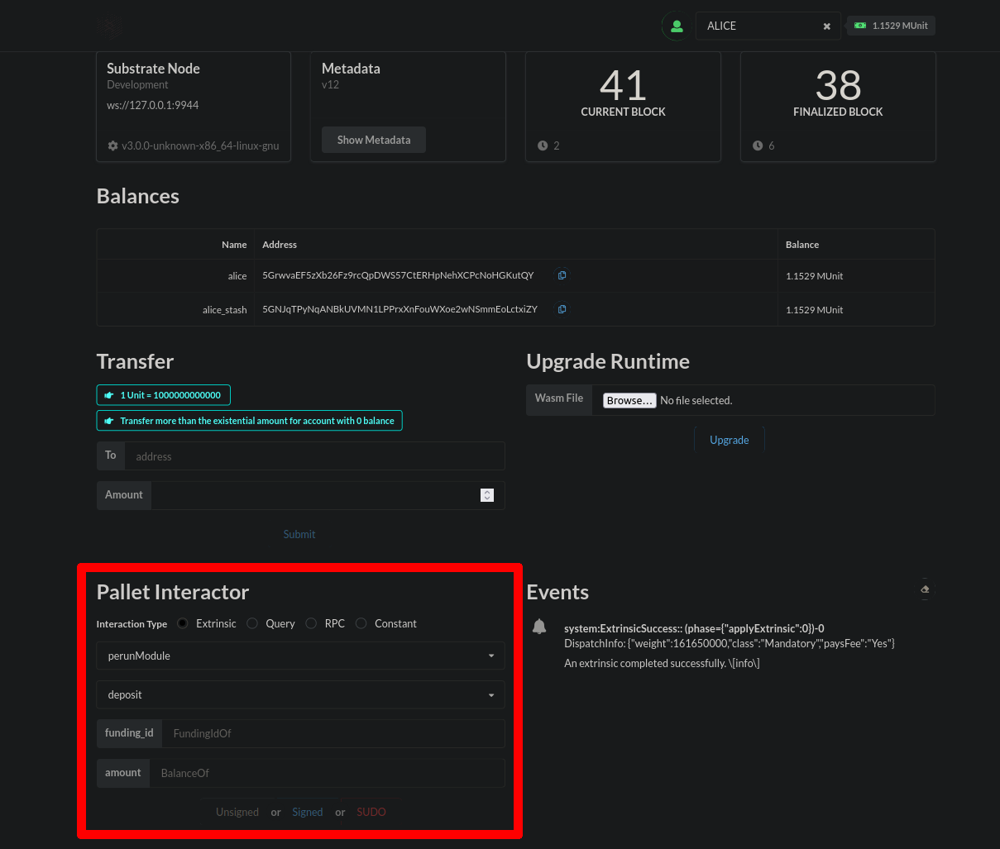
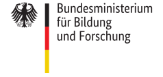

<h1 align="center"><br>
    <a href="https://perun.network/"></a>
<br></h1>

<h4 align="center">Perun Polkadot Node</h4>

<p align="center">
  <a href="https://www.apache.org/licenses/LICENSE-2.0.txt"></a>
   <a href="https://github.com/perun-network/perun-polkadot-node/actions/workflows/rust.yml"></a>
</p>

*Perun Polkadot Node* demonstrates how to integrate the [Perun Pallet] into a substrate chain.  
It uses the [Node template] and [Frontend template] from substrate and configures them for Perun.

## Repo Structure

* `frontend/` based on [frontend template]
  * [src/config/types.json] holds some type definition for the frontend
* `node/` based on [node template]
  * [pallets/perun] contains the [Perun Pallet]
  * [runtime/Cargo.toml] configures the Node
  * [runtime/src/lib.rs] configures the *Perun Pallet*


## Quickstart

You can use docker to start the *node* and the *frontend* to try out the *Perun Pallet*.

```bash
docker-compose build
docker-compose up
```

The frontend will be available at [localhost:8000/substrate-front-end-template].  

<p align="center">
<a href=".assets/pallet_perun.png"></a>
</p>

You can try out different Extrinsic calls in the *Pallet Interactor*.  
This is currently not very practical since hashes and off-chain signatures are required, which are hard to enter manually. Using mocked hashes and sigs could be done here.

### Docker images

Instead of building the project yourself, you can use our images and start them individually:  
```sh
docker run --rm -it -p9944:9944 ghcr.io/perun-network/polkadot-test-node
```
```sh
docker run --rm -it -p8000:8000 ghcr.io/perun-network/polkadot-test-frontend
```
The frontend will be available at [localhost:8000/substrate-front-end-template].  

## Development

Clone the repository with submodules.  
```bash
git clone --recurse-submodules https://github.com/perun-network/perun-polkadot-node
cd perun-polkadot-node
```

Ensure that the [Rust toolchain](#installing-the-rust-toolchain) is installed.
Then build the node.

```bash
cd node
cargo build --release
```

For testing, run the compiled node binary as follows.
```sh
cd node/target/release
./node-template --dev --ws-external --rpc-methods=Unsafe -lruntime=debug
```

You can start the frontend in a second terminal.
```bash
cd frontend
yarn install
yarn start
```

This should automatically open your browser with [localhost:8000/substrate-front-end-template].

### Logging

In the node, you can print log messages using `frame_support::runtime_print`.
```
frame_support::runtime_print!("CustomValue: {:?}", val);
```
In order to see the log messages, make sure to run the node with `-lruntime=debug`.

### Benchmarking

This node provides a runtime for benchmarking the [Perun Pallet].
Enter the `node/` directory and run the following command:
```sh
cargo run --release --features runtime-benchmarks benchmark --execution wasm --wasm-execution compiled --chain dev --pallet 'pallet_perun' --extrinsic '*' --steps 20 --repeat 10 --raw --output pallets/pallet-perun/src/weights.rs
```

This will write the updated weights into the `weights.rs` file of the pallet.  
More information can be found in the [Substrate Benchmarking Doc].

### Installing the Rust toolchain

Check out [rust-land.org] to install `rustup`, then adjust your toolchain for this repo:  

```bash
rustup default stable
rustup update nightly
rustup update stable
rustup target add wasm32-unknown-unknown --toolchain nightly
```

## Funding

The development of this project is supported by the [Web3 Foundation] through the [Open Grants Program].  
The development of the go-perun library is supported by the German Ministry of Education and Science (BMBF) through a Startup Secure grant.

<p align="center">
<a href="https://web3.foundation/about/"></a>
<a href="https://www.bmbf.de/"></a>
</p>

## Security Disclaimer

This software is still under development.
The authors take no responsibility for any loss of digital assets or other damage caused by the use of it.
## Copyright

Copyright 2021 PolyCrypt GmbH.  
Use of the source code is governed by the Apache 2.0 license that can be found in the [LICENSE file](LICENSE).


<!--- Links -->

[Perun Pallet]: https://github.com/perun-network/perun-polkadot-pallet
[node template]: https://github.com/substrate-developer-hub/substrate-node-template
[frontend template]: https://github.com/substrate-developer-hub/substrate-front-end-template
[Substrate Benchmarking Doc]: https://docs.substrate.io/v3/runtime/benchmarking/
[src/config/types.json]: frontend/src/config/types.json
[runtime/Cargo.toml]: node/runtime/Cargo.toml
[runtime/src/lib.rs]: node/runtime/src/lib.rs#L280
[pallets/perun]: node/pallets/pallet-perun
[Open Grant]: https://github.com/perun-network/Open-Grants-Program/blob/master/applications/perun_channels.md#w3f-open-grant-proposal
[Web3 Foundation]: https://web3.foundation/about/
[Open Grants Program]: https://github.com/w3f/Open-Grants-Program#open-grants-program-
[rust-land.org]: https://www.rust-lang.org/tools/install

<!-- markdown-link-check-disable -->
[localhost:8000/substrate-front-end-template]: http://localhost:8000/substrate-front-end-template
<!-- markdown-link-check-enable -->
